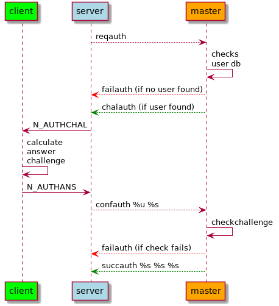

# Blue Nebula auth

This repository provides a standalone implementation of the "crypto" required for the traditional [Blue Nebula](https://blue-nebula.org) auth system. Most of the code has been extracted from the [Blue Nebula code base](https://go.blue-nebula.org/code).

The CLI tool can be used to simulate an authentication session manually. Also, it's possible to use this CLI tool e.g., in a masterserver implementation, to avoid any sort of native interfaces or custom implementations of the not-so-easy-to-read code.


## Auth workflow

There are two authentication workflows:

  - clients authenticate to the server through the master (`auth`)
  - servers authenticate to the master (`authserver`)
  
This project focuses around the client auth workflow currently.




## Usage

```text
> ./bluenebula-auth help
Usage: ./bluenebula-auth <command> [args...]
  help                - show this help text and exit
  reqauth <pubkey>    - generate challenge for given pubkey
  confauth <response> - validate client reply
  genkey              - generate key pair
  pubkey <privkey>    - generate (derive) public from private key
```
